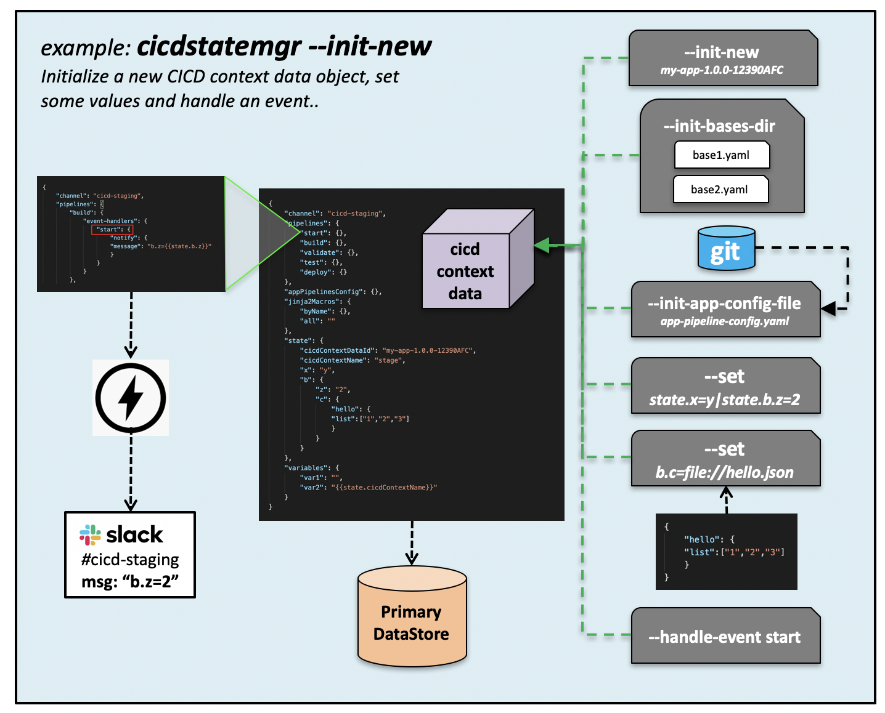
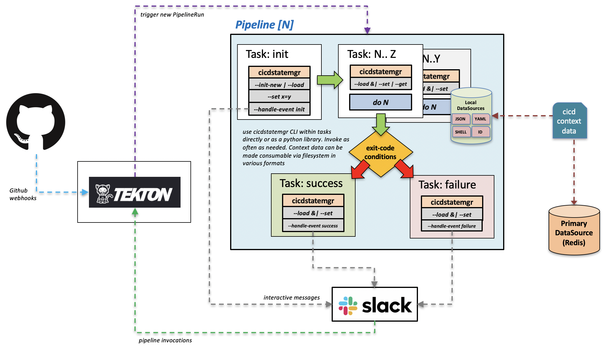
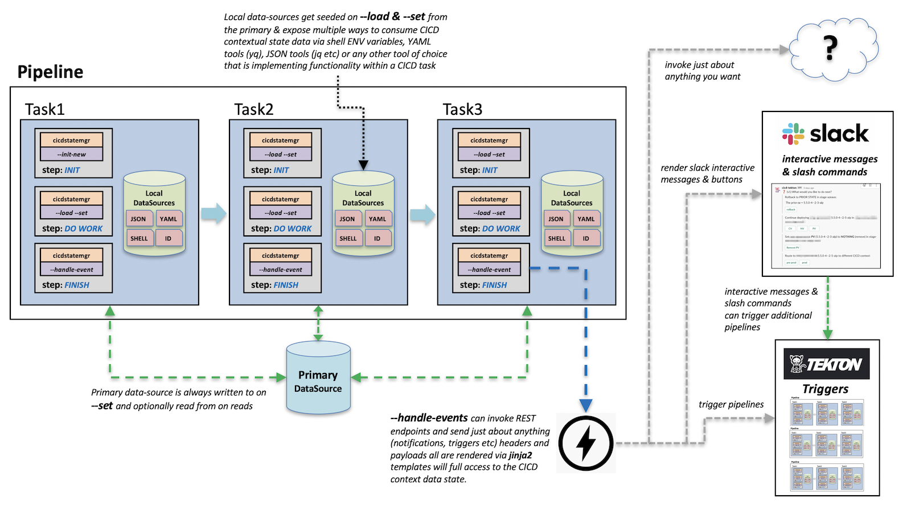

# cicdstatemgr

[](https://travis-ci.org/bitsofinfo/cicdstatemgr) [](https://badge.fury.io/py/cicdstatemgr) [](https://hub.docker.com/repository/docker/bitsofinfo/cicdstatemgr)


`cicdstatemgr` is a Python package who's intent is to make your life a bit easier when developing a CICD solution that needs to maintain configuration and state across multiple workflows and contexts of execution while providing a framework for enabling reaction to "events" by invoking custom endpoints. These endpoints can be the CICD engine itself to trigger new flows or other services like Slack for enabling user interaction with a pipeline.

This project was born out of needs that arised when building a custom CI/CD solution using the Kubernetes native [Tekton Pipelines](https://github.com/tektoncd/pipeline) project.

* [Status](#status)
* [Overview](#overview)
* [Concepts](#concepts)
* [Usage](examples/basics) 
* [Examples](examples/) 
* [Install](#install)
* [Docker](#docker)
* [Security](#security)

Here is a video screencast that walks through [an example](examples/tekton) that you can [experiment with yourself](examples/tekton):

[](https://www.youtube.com/watch?v=449xT2iDlzQ)

The best place to start is the [examples](examples/) or read some [background info here](https://bitsofinfo.wordpress.com/2020/08/13/tekton-pipelines-cicd-slack-triggers-state/)

## Status

This project is still considered **beta** software. It is currently being used in a single production CICD platform that services dozens of individual applications.

## Overview 

So what does this do exactly? ([you can also read this blog post](https://bitsofinfo.wordpress.com/2020/08/13/tekton-pipelines-cicd-slack-triggers-state/))

`cicdstatemgr` is a small python library and CLI to help you maintain state and configuration data that can span process/task boundaries in a CICD system that does not natively provide such a facility. It also provides some built in features that let you handle "events" by invoking HTTP endpoints for doing things like notifications, triggering hooks, integrating with end-user interactive apps like Slack/Teams etc.

Within a CICD system you often have one or more pipelines, each of which is made up of one or more tasks. Sometimes tasks run one after another, other times there is some manual intervention etc. Likewise when you have different but related pipelines that have to execute in a specific order. Within this kind of setup you generally have a lot of configuration and execution "state" that you want to maintain, i.e. variables, meta-data, audit information etc, and you want to be able to manage this state across different processes boundaries. 

You also might have a need to let each application that is being pushed through a pipeline to provide its own customizations to modify the behavior of your CICD engine.

For example in its simplest form, some raw `state` might look like this:
```
state:
  appVersion: 1.0.0
  appName: my-app
  myProp: myValue
  myProp2: 
    p1: v1
    p2: v2
  events:
    build:
      status: failed
  ...
```

Your tasks might need to both read and write to information in this `state` and ensure its persisted somewhere. `cicdstatemgr` can help with this.

## What cicdstatemgr is (and is not)

* `cicdstatemgr` is NOT a CICD engine nor an out of the box CICD solution; its only a tool that you can use within a CICD framework to help configure, customize and maintain state for your CICD application as well as invoke endpoints in reaction to things going on in your CICD pipeline.

* You can use `cicdstatemgr` and it's config format for app pipeline config files as a foundation by which to build your own custom CICD solution in conjunction with an underlying engine for the actual pipeline execution; such as [Tekton pipelines](https://tekton.dev)

* `cicdstatemgr` is a way to store and load data related to your pipeline and access it in numerous ways; via it's CLI, a network store (`redis`) or via files cached on disk within your task's filesystem (`sourceable` shell files, `yaml`, `json` etc)

* `cicdstatemgr` is a way to allow each of your app's that flow through your CICD system to customize the behavior of your pipelines at runtime via app pipeline configuration files that live within each app's source.

* `cicdstatemgr` can in theory be used in any CICD execution platform as you just invoke it from within logical tasks/steps in any CICD pipeline. that said; this project arose out of needs that came up when using [Tekton Pipelines](https://tekton.dev) 

---

**Example pattern that can be used with `cicdstatemgr` and Tekton pipelines:**


---

**High level flow example:**

  
## Simple example

For a more complete set of CLI usage examples see: [examples](examples/)

To see a more involved example on how `cicdstatemgr` can be used along with `Tekton pipelines` check out the [examples/tekton](examples/tekton) project.


Init:
```
python3 -m venv venv
source venv/bin/activate
pip install wheel
pip install cicdstatemgr

export CICDSTATEMGR_CONFIG_PATH=examples/simple/config.yaml
export CICDSTATEMGR_SECRETS_PATH=examples/simple/secrets.yaml

export CICDSTATEMGR_CONTEXT_DATA_ID=$(cicdstatemgr \
                                    --init-new "context-data-id-1" \
                                    --init-app-config-file examples/simple/app.yaml \
                                    --init-cicd-context-name stage \
                                    --set "state.key1=value1"\
                                    --set 'state.template1={{ctx.data1}}')

cat localdata/cicdContextData.yaml

pipelines:
  build:
    event-handlers:
      testEvent:
        notify:
          message: Basic message {{state.key1}}
appPipelinesConfig:
  jinja2-macros:
    echo: "\n  hello {{msg}}\n\n"
  cicd-contexts:
    stage:
      pipelines:
        build:
          event-handlers:
            testEvent:
              notify:
                message: Basic message {{state.key1}}
jinja2Macros:
  byName:
    echo: "\n  hello {{msg}}\n\n"
  all: "\n  hello {{msg}}\n"
state:
  cicdContextDataId: context-data-id-1
  cicdContextName: stage
  key1: value1
  template1: '{{ctx.data1}}'
```


Get:
```
cicdstatemgr \
  --get "state.template1" \
  --tmpl-ctx-var 'ctx.data1=state.key1'

value1
```

Handle event:
```
cicdstatemgr \
  --handle-event build=testEvent

...
2020-08-10 02:21:19,887 - root - DEBUG - event_handle_notify(): POST response OK {'args': {}, 'data': '{"message": "Basic message value1 hello world"', 'files': {}, 'form': {}, 'headers': {'x-forwarded-proto': 'https', 'x-forwarded-port': '443', 'host': 'postman-echo.com', 'x-amzn-trace-id': 'Root=1-5f30af1f-ecf28bcce2278a5a5bd8d326', 'content-length': '46', 'user-agent': 'python-requests/2.24.0', 'accept-encoding': 'gzip, deflate', 'accept': '*/*', 'content-type': 'application/json; charset=UTF-8', 'authorization': 'Bearer FAKE_TOKEN', 'cache-control': 'no-cache'}, 'json': None, 'url': 'https://postman-echo.com/post'} 
...
```

For a more complete set of CLI usage examples see: [examples](examples/)

To see a more involved example on how `cicdstatemgr` can be used along with `Tekton pipelines` check out the [examples/tekton](examples/tekton) project.


## Making use of cicdstatemgr

To make use of `cicdstatemgr` you generally will follow a process like this:

* Define your pipelines and their tasks using a framework like [Tekton pipelines](https://github.com/tektoncd/pipeline)

* Provide a way to create instances of your pipelines dynamically with the parameters they need. You can acheive this with a project like [Tekton Triggers](https://github.com/tektoncd/triggers)

* Introduce `cicdstatemgr` within your pipeline's tasks to `--init-new` "cicd contexts"; `--load`, `--get`, `--set` data related to the instance of the pipeline being executed

* Use `cicdstatemgr` within your tasks to handle arbitrarily defined events (that you define) via `--handle-event` invocations. These "events" can trigger simple calls to endpoints (like Slack, or direct back to the CICD system itself) with completely customizable headers/payloads which are rendered via `jinja2` templates that have full access to the cicd context data that `cicidstatemgr` manages.

* The best way to get familiar with this is to [check out the examples](examples/)

## Concepts

Here are some relevant terms referred to when using `cicdstatemgr`. 

* **cicd context**: defines a logical context within a CICD system; a CICD context is comprised of one or more named "pipelines". You can have multiple `cicd-contexts` within a system. What makes one `cicd-context` different from another might be the target systems it deploys application to, or the security context it executes within etc. The names of contexts and how many contexts you have is totally up to you.
  
* **cicd context data**: defines a set of "data" (configuration + state) that is created at the start of a new `cicd-context` and made available to all pipelines that execute within scope of the `cicd-context`. What is contained within the `state` is totally up to you. "When" a new "cicd context" is "started" again... is totally up to you. It just depends when you use the `--init-new` option of `cicdstatemgr`

* **cicd context data ID**: the unique identifier for each set of `cicd context data`. You define what this is when you call `--init-new`. Once a context is created you use this ID to fetch the `cicd context data` for all subsequent operations.


## Requirements

Python 3.8+

## Install

`cicdstatemgr` can be used as a Python module dependency within another Python script OR you can run it independently via its CLI interface natively or via Docker.

### Install via pip

```
pip install cicdstatemgr 
```

Once installed you can just use the CLI. See [examples/basics](examples/basics) to get started with the CLI
```
cicdstatemgr --help
```

Or use it from within another Python program:
```
$> python3
Python 3.8.3 (default, Jul  7 2020, 13:01:48) 
[Clang 11.0.0 (clang-1100.0.33.17)] on darwin
Type "help", "copyright", "credits" or "license" for more information.

>>> from cicdstatemgr import cicdstatemgr

>>> mgr=cicdstatemgr.CicdStateMgr(configFilePath='examples/basics/config.yaml',secretsFilePath='examples/basics/secrets.yaml')

>>> mgr
<cicdstatemgr.cicdstatemgr.CicdStateMgr object at 0x10df2e310>
```

## Docker

https://hub.docker.com/repository/docker/bitsofinfo/cicdstatemgr

```
docker run -it bitsofinfo/cicdstatemgr:latest cicdstatemgr -h
```

## Security 

`cicdstatemgr` provides a lot of flexibility and one of it's core capabilities is doing runtime evaluations of data contained in the `cicdContextData` via `jinja2` templating to yield results. What you do with those results (strings) is up to you! 

If you utilize these features and blindly pass the resulting data on to language/shell interpreters this could result in exposing your system to code injection if you are not careful with what you are doing. This is true of any CICD platform who's "inputs" ultimately are consumed from sources maintained by humans (i.e. SCMs). You should always behave with a trust no-one mindset and check both your inputs that can dynamically create derived results, especially those derived results are used to dynamically create commands or payloads to endpoints etc. 

The point of this section is simply that: a friendly reminder!

## Related

https://github.com/bitsofinfo/slack-payload-handler


