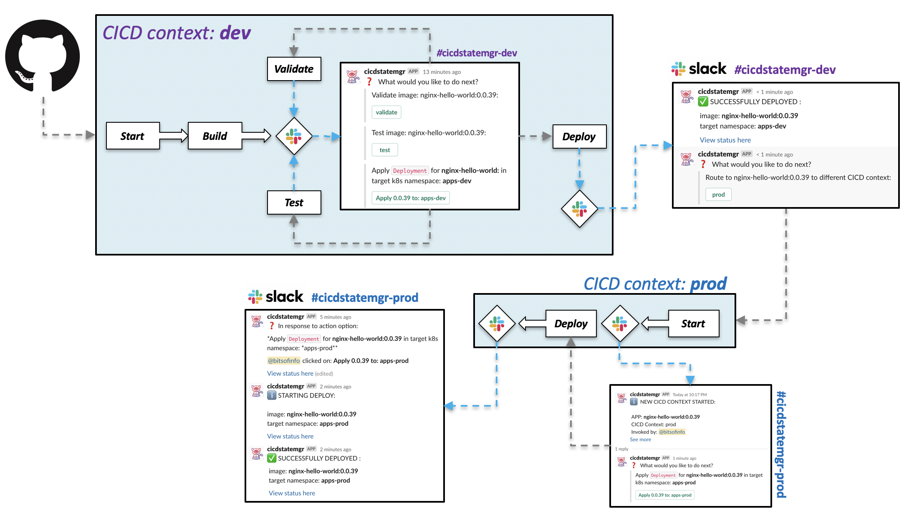

# Tekton example

This is a more involved example showing how `cicdstatemgr` can be used to enhance and orchestrate a Tekton CICD workflow by utilizing Slack interactive messages to provide user-interaction. Visually the flow this example produces by leveraging `cicdstatemgr` looks like this:



This example runs locally using [minikube](https://kubernetes.io/docs/tasks/tools/install-minikube/)

This assumes and prefers a clean minikube cluster environment on your machine. This example has been run on **os-x**.

Need help? [join bitsofinfo.slack.com](https://join.slack.com/t/bitsofinfo/shared_invite/zt-g25vqkt2-SrA1SfBXALoAL17J~03tfQ)

## Overview

Don't want to run it locally? Watch here:

TBD


## Pre-requisites

The following needs to be installed on your local.

* [minkube v1.12.1+](https://kubernetes.io/docs/tasks/tools/install-minikube/) (assumes os-x w/ [hyperkit](https://minikube.sigs.k8s.io/docs/drivers/hyperkit/))

* [ngrok free](https://ngrok.com/) and ensure the `ngrok` command is on your `$PATH`

* `kubectl`: 1.16+
  
* All commands below should run in the `bash` shell

You also need to do the following before starting:

* Clone this project: `git clone https://github.com/bitsofinfo/cicdstatemgr.git`

* Create your own fork on github of [nginx-hello-world](https://github.com/bitsofinfo/nginx-hello-world/)
  
* Ensure [ngrok is setup and functioning](https://dashboard.ngrok.com/get-started/setup) on your local machine
  
* Have your own free [slack workspace](https://slack.com/help/articles/206845317-Create-a-Slack-workspace) and the proper permissions to install apps into it and manage it.

* Also this assumes you have cloned this project [cicdstatemgr](https://github.com/bitsofinfo/cicdstatemgr/) and have a terminal opened to `examples/tekton`

## Configure your slack app

You will need to create a new [slack app in your workspace](https://api.slack.com/apps) by doing the following:

* Once logged into your slack workspace go to: https://api.slack.com/apps

* Click on *"Create New App"*

* You can name the app whatever you want and choose your workspace for it, then click *"create app"*

* Under *"Basic Information"* click on the *"Interactive Components"* feature box, then toggle *"Interactivity"* to **"on"**

* For the *"Request Url"* just enter `https://postman-echo.com` for now and *"Save changes"* **(you will change this later)**
  
* Click on the *"OAuth & Permission"* section, scroll down to *"Scopes"* and click on *"Add an OAuth Scope"*, then grant **app_mentions:read** and **chat:write**

* Next lets install the app to your workspace. Click on **"Install app to workspace"**, review the permissions presented then **Allow**

* **IMPORTANT**: Once installed you will see the `Bot User OAuth Access Token` displayed, copy this value and put it into the file `cicdstatemgr/examples/tekton/pipelines/secrets/slack-bearer-token` (with no new line)

* **IMPORTANT**: Next, click on *"Basic Information"*, scroll down to *"App Credentials"* and copy the value of **Verification Token** and paste it into the file `cicdstatemgr/examples/tekton/core/secrets/slack-oauth-token` (with no new line)

## Setup minikube, tekton and example pipelines

Clone this project (if not already done)
```
git clone https://github.com/bitsofinfo/cicdstatemgr.git
```

Run the install script:
```
cd cicdstatemgr/examples/tekton
./install.sh
```

When all done you can remove with:
```
./remove.sh
```

The install script assumes (and prefers) you have no prior minikube cluster, it starts `minikube` enables the `registry` addon, then proceeds to apply a base [Tekton](https://tekton.dev/) installation (complete with the 3 Tekton projects: `pipelines`, `triggers`, `dashboard`). On top of Tekton, it then proceeds to install a Tekton [CICD workflow of pipelines](pipelines/) which utilize `cicdstatemgr` to orchestrate all interactions.

Once things are up and running, the script also creates a [ngrok tunnel](https://ngrok.com/) to the [Tekton webhook/eventlistener endpoint](pipelines/triggers.event-listener.yaml) which is emitted to STDOUT. 

**IMPORTANT**: *Keep this terminal open or save the output from the script! We will use the configured NGROK urls below*

## Post setup steps

Now that your local minikube cluster is up and running, we need to do two things.

### Update your slack app

Update the [slack app's interactive component](https://api.slack.com/apps) you created earlier to point to your `ngrok` URI.

* Go your your slack apps' *"Basic Information"* section, click on *"Features and functionality"* then *"Interactive Components"*
* Next update the *"Request Url"* field with the `ngrok` event listener URI emitted by the [install.sh](install.sh) script above. It should look something like `https://xxyyzz.ngrok.io`

### Create the slack channels

In your slack workspace, create two channels `#cicdstatemgr-dev` and `#cicdstatemgr-prod`, and be **sure to invite your slack app** to both channels! 

### Update your nginx-hello-world fork's webhooks setting

Configure YOUR FORK of [nginx-hello-world](https://github.com/bitsofinfo/nginx-hello-world/) to send webhook events.

* Go your your github `nginx-hello-world` fork's **Settings** section. Then click on **Webhooks**
  
* Next click on *"Add webhook"*

* Set the *"Payload URL"* field with the `ngrok` event listener URI emitted by the [install.sh](install.sh) script you ran above. It should look something like `https://xxyyzz.ngrok.io`

* Set *"Content type"* to `application/json`

* Set the *"Secret"* to `123`

* For *"Events to send"* we ONLY NEED the `push` event.

* Ensure its active and save

# View the Tekton dashboard

Go back to your terminal and find the output from the `install.sh` you ran earlier. 

Find the `Tekton Dashboard: http:/x.x.x.x:xxxxx` output, grab this URL and open it in your browser. 

You can also get it via `minikube service list`

# Trigger the build pipeline

Once it is up you can trigger the pipeline by pushing a tag to your FORK of [nginx-hello-world](https://github.com/bitsofinfo/nginx-hello-world/)

```
cd [myforkof-nginx-hello-world]

git tag -a 1.0.0 -m "1.0.0"; git push origin 1.0.0
```

This should trigger a new `start` pipeline run followed by an auto trigger of `build`. Slack alerts should show up in your Slack workspace's `#cicdstatemgr-dev` channel and you can view your Tekton dashboard at the URLs emitted from the install script run earlier.

If you click on any `deploy/apply` buttons this will apply the `nginx-hello-world` k8s manifests to the k8s cluster within either the `apps-dev` or `apps-prod` namespaces. 

You can then do a `minikube service list` to get a local URL to hit them app to verify they are running.

It should look something like this as `nginx-hello-world-[version]` deployments are applied to the cluster as you click on the buttons.

```
|------------------|-----------------------------|--------------------|----------------------------|
|    NAMESPACE     |            NAME             |    TARGET PORT     |            URL             |
|------------------|-----------------------------|--------------------|----------------------------|
| apps-dev         | nginx-hello-world-1-0-0    | http/80            | http://192.168.64.34:30691 |
| apps-prod        | nginx-hello-world-1-0-0    | http/80            | http://192.168.64.34:30425 |
....
```

## Next steps

This example is intended to serve as... well just that, an example of how you can leverage `cicdstatemgr` along with [Tekton](https://github.com/tektoncd) to create CICD workflows and mediate a lot of the interaction via a tool like Slack.

Want to see how Tekton was installed? Check out the [core/ components](core/)

Want to see how the Tekton pipelines/triggers and EventListener are defined? Check out the [pipelines/ components](pipelines/)

Want to see how all the Slack messages and interaction work? Check out the [pipelines/bases](pipelines/bases) and [pipelines/confs](pipelines/confs) directories which contain the configs and pipeline-configs that `cicdstatemgr` consumes.


## Cleanup

Running the following will kill the `ngrok` process (the pid is in `.ngrok.pid`), and then issue a `minikube delete`

Note that if you run `install.sh` again, you will have to re-register the `ngrok` url again with slack/github as the url changes everytime you restart `ngrok`

```
./remove.sh
```

## notes

Debugging issues w/ pods in Minikube:
```
kubectl run -it --serviceaccount=cicd-tekton --namespace tekton-pipelines  cicd-toolbox --image bitsofinfo/cicd-toolbox:latest /bin/bash 
```

Get the minikube registry addon's cluster ip
```
kubectl get svc registry --output=jsonpath='{.spec.clusterIP}' --namespace=kube-system
```

Fantastic tool for dealing w/ minikube registry DNS issues (push/pull) from within the cluster itself:
https://github.com/kameshsampath/minikube-helpers/blob/master/registry/README.md
https://developers.redhat.com/blog/2019/07/11/deploying-an-internal-container-registry-with-minikube-add-ons/